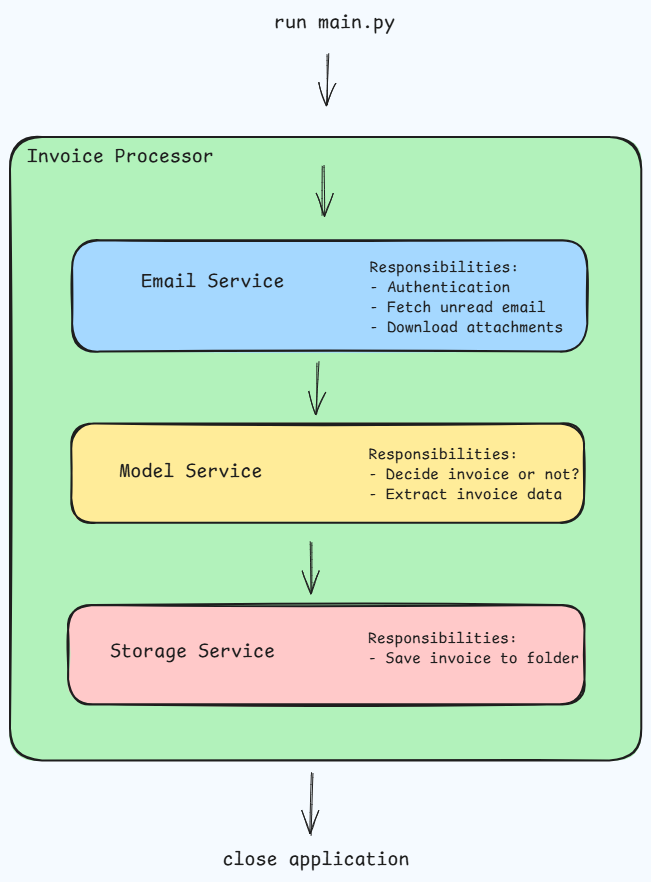

# Email Invoice Agent

Scans an email inbox, detects invoice emails, downloads PDF attachments, verifies them with an LLM, and stores them in folder.

---

## Pipeline Overview

<p align="center">
  
</p>


---

## How to use?

Follow these steps to run the project.

### 1. Create a Google Cloud Project

- Go to https://console.cloud.google.com/
- Create a new project. 
- Select the project once it's created.

### 2. Enable the Gmail API

- Navigate to **APIs & Services → Library**. 
- Search for **Gmail API**. 
- Click **Enable**.

### 3. Configure the OAuth Consent Screen

- Go to **APIs & Services → OAuth consent screen**. 
- Choose **External** (unless using Google Workspace). 
- Fill in the required app information. 
- Save the configuration. 
- Under **Test users**, add the Google account that will use this application.

### 4. Create OAuth Credentials

- Go to **APIs & Services → Credentials**. 
- Click **Create Credentials → OAuth Client ID**. 
- Select **Desktop App**. 
- Create the client and download the JSON file. 
- Rename the downloaded file to **`credentials.json`**. 
- Place `credentials.json` in the project's root directory.

### 5. Install Dependencies

```bash
pip install -r requirements.txt
```

### 6. Run the `main.py`

On the first run:

* A browser window will open.
* Sign in with your Google account.
* Grant the requested permissions.
* A **`token.json`** file will be created automatically.

`token.json` stores your authentication tokens and will be reused on future runs, so you normally won't need to sign in again.

Your project structure should look like:

```text
project/
├── credentials.json
├── token.json      # Created automatically after first login
├── src/
└── ...
```

---
## Optimizations

- Don't send all invoices to model, first filter them locally by using regex on their OCR data
- Implement model prediction confidence
- Create folders for each company dynamically and save pdfs in company specific folders


---

## Extension Ideas
- Save extracted data to database (MySQL, SQLite, etc.)
- Use system/user prompt & model input parameters (e.g. temp, top_p, max_tokens, etc.) to control model output better
- Send pdf as attachment with prompt to model, so model can utilize its multi-modal capabilities and make more precise prediction 
- Use OCR specialized models like LayoutLM for such tasks
- Automate using cron jobs (for linux) or task scheduler (for windows)
- Integrate Telegram bot for notifications  

---

## Tech stack

- Python
- Gmail API
- Gemini API
- OAuth 2.0 

---